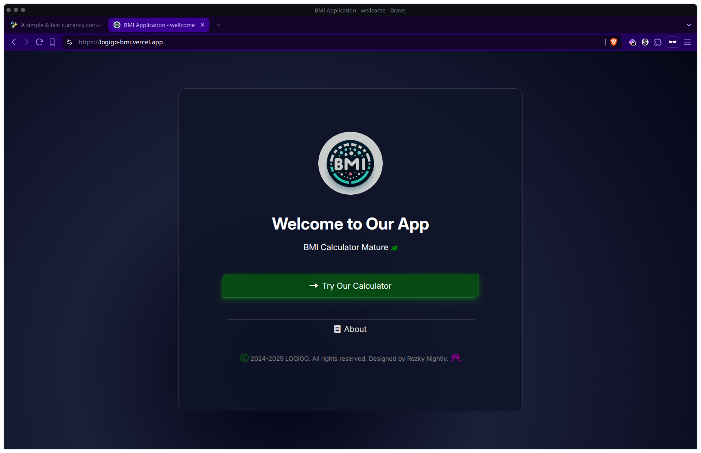
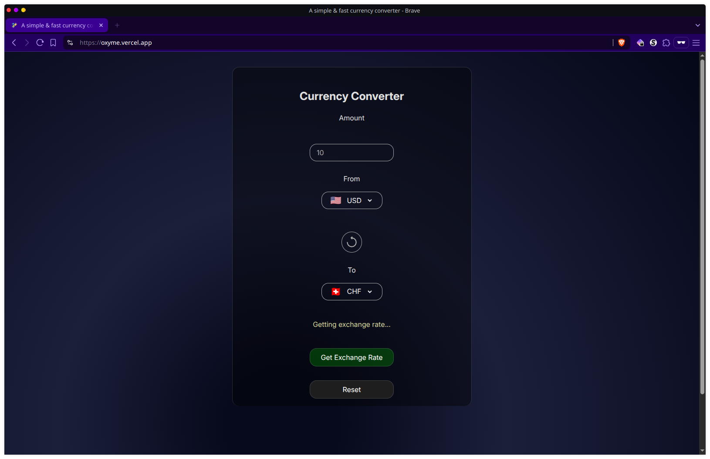

<div align="center">

```css
/* Neutron Star Glassmorphism Theme */
background: radial-gradient(circle at 20% 50%, #1a0033 0%, #000011 25%, #0d001a 50%, #000000 100%);
backdrop-filter: blur(20px);
border: 1px solid rgba(138, 43, 226, 0.2);
box-shadow: 0 8px 32px 0 rgba(75, 0, 130, 0.37);
```

</div>

<h1 align="center">
  <br/>
  <span style="background: linear-gradient(45deg, #ff6b6b, #4ecdc4, #45b7d1, #96ceb4, #feca57); -webkit-background-clip: text; -webkit-text-fill-color: transparent; font-size: 3em; text-shadow: 0 0 30px rgba(138, 43, 226, 0.5);">✨ WEB-OXY ✨</span>
</h1>

<p align="center">
  <em style="color: #b19cd9; font-size: 1.2em;">🌌 Crafting Digital Experiences in the Cosmic Web 🌌</em>
</p>

<div align="center" style="margin: 30px 0;">

[](https://github.com/oxyzenQ/web-oxy/stargazers)
[](https://github.com/oxyzenQ/web-oxy/issues)
[](https://github.com/oxyzenQ/web-oxy/contributors)
[](LICENSE)

</div>

---

<div align="center">

## 🌟 **STELLAR PROJECT CONSTELLATION** 🌟

*Navigate through our cosmic collection of web applications*

</div>

### 🔮 **Quantum BMI Calculator**
> *Measure your cosmic mass with neutron star precision*

**🚀 Live Mission Control:** [logigo-bmi.vercel.app](https://logigo-bmi.vercel.app)

<div align="center" style="background: rgba(138, 43, 226, 0.1); border-radius: 20px; padding: 20px; margin: 20px 0; backdrop-filter: blur(10px); border: 1px solid rgba(138, 43, 226, 0.3);">
  
  
  **✨ Features:**
  - 🌌 Glassmorphism UI with cosmic animations
  - ⚡ Real-time calculations at light speed
  - 🎨 Neutron star inspired color palette
  - 📱 Responsive across all dimensions
</div>

---

### 💫 **Galactic Currency Converter**
> *Exchange currencies across the cosmic marketplace*

**🚀 Live Mission Control:** [oxyme.vercel.app](https://oxyme.vercel.app)

<div align="center" style="background: rgba(75, 0, 130, 0.1); border-radius: 20px; padding: 20px; margin: 20px 0; backdrop-filter: blur(10px); border: 1px solid rgba(75, 0, 130, 0.3);">
  
  
  **✨ Features:**
  - 🌠 Real-time exchange rates from across the galaxy
  - 🔥 Blazing fast conversions
  - 🎭 Elegant glassmorphism design
  - 🌍 Multi-planetary currency support
</div>

---

<div align="center">

## 🛸 **MISSION CONTROL CENTER** 🛸

</div>

<div style="background: linear-gradient(135deg, rgba(138, 43, 226, 0.1) 0%, rgba(75, 0, 130, 0.1) 100%); border-radius: 20px; padding: 30px; margin: 20px 0; backdrop-filter: blur(15px); border: 1px solid rgba(138, 43, 226, 0.2);">

### 🚀 **Launch Sequence**

```bash
# Clone the cosmic repository
git clone https://github.com/oxyzenQ/web-oxy.git

# Navigate to mission directory
cd web-oxy

# Initialize your stellar journey
open index.html
```

### 🌌 **Exploration Guidelines**

- 🔍 **Discover:** Explore the source code nebula
- 🎨 **Create:** Remix and enhance components
- 🤝 **Collaborate:** Join our cosmic community
- 🚀 **Deploy:** Launch your own stellar projects

> **No gravitational restrictions** — just **explore, learn, and create**! 🌟

</div>

---

<div align="center">

## 🌠 **COSMIC ACKNOWLEDGMENTS** 🌠

</div>

<div style="background: rgba(138, 43, 226, 0.05); border-radius: 15px; padding: 25px; margin: 20px 0; backdrop-filter: blur(10px); border: 1px solid rgba(138, 43, 226, 0.15);">

**🌟 Stellar Contributors:**
- 👨‍🚀 [rezky_nightky](https://github.com/oxyzenQ) - *Mission Commander*
- 🌌 The Open Source Galaxy
- 🚀 All Cosmic Explorers & Contributors

**🛸 Powered by:**
- ⚡ Pure HTML, CSS & JavaScript
- 🎨 Glassmorphism Design Philosophy  
- 🌌 Neutron Star Aesthetics
- 💫 Infinite Creativity

</div>

---

<div align="center" style="background: linear-gradient(45deg, rgba(138, 43, 226, 0.1), rgba(75, 0, 130, 0.1)); border-radius: 20px; padding: 20px; margin: 20px 0; backdrop-filter: blur(20px); border: 1px solid rgba(138, 43, 226, 0.3);">

**🌌 Crafted with 💻, ☕, and neutron star energy 🌌**

*"In the vast cosmos of code, every project is a new star waiting to shine"* ✨

---

<sub>🔮 **web-oxy** • Exploring the infinite possibilities of web development • 🔮</sub>

</div>
